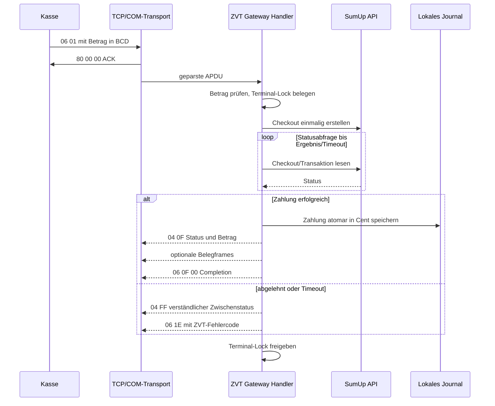
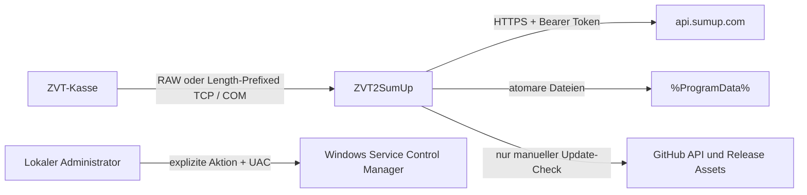

# Architektur

ZVT2SumUp trennt Protokoll, Geschäftslogik, Infrastruktur und Darstellung. Die
Desktop-App und der Windows-Dienst verwenden dieselben Runtime-Komponenten; es
gibt keine zweite Zahlungsimplementierung im UI.

## Komponenten

| Projekt | Inhalt | Darf kennen |
|---|---|---|
| `Zvt2SumUp.Core` | Modelle, Optionen, Geldkonvertierung, Pfade, Redaction und Interfaces | keine Infrastruktur |
| `Zvt2SumUp.Protocol` | APDU-Registry, ZVT-Parser, BCD, BMP, BER-TLV, TCP- und serielles Framing, Response Builder | Core |
| `Zvt2SumUp.SumUp` | typisierter SumUp-Client, Request-/Response-Verträge und Statusmapping | Core |
| `Zvt2SumUp.Infrastructure` | TCP/COM, Gateway-Handler, Journal, Belege, DPAPI, Logging und Updateprüfung | Core, Protocol, SumUp |
| `Zvt2SumUp.Service` | Generic Host, Windows-Service-Lebenszyklus und Worker | Core, Infrastructure |
| `Zvt2SumUp.Desktop` | WinForms-Verwaltung, asynchrone Aktionen und Dienststeuerung | alle Laufzeitprojekte |
| `Zvt2SumUp.Tools` | CLI, Simulatoren, COM-Erkennung und explizite Servicebefehle | Core, Protocol, Infrastructure |
| `Zvt2SumUp.Tests` | lokale Fakes und deterministische Unit-/Integrationstests | Laufzeitprojekte |

## Datenfluss einer Zahlung

Im KORONA-RAW-Modus entfernt der Transport optionale `04 FF`, `06 D1` und
`06 D3` aus der erfolgreichen Antwort. Dadurch bleibt exakt `ACK`, `04 0F` und
`06 0F 00` in der erwarteten Reihenfolge.

## Ausführungsmodelle

`ZVT2SumUpGateway.exe` entscheidet ausschließlich am Prozesseinstieg:

- ohne Schalter: native WinForms-App
- `--service`: Windows-Service-Host
- `--smoke-test`: UI-Startprüfung ohne dauerhaftes Fenster
- `--service-smoke-test`: Hostprüfung ohne Serviceinstallation

Die Tools starten einen Konsolenhost mit `run-console`. GUI und Service dürfen
nicht gleichzeitig denselben TCP- oder COM-Endpunkt belegen.

## Nebenläufigkeit und Abbruch

- `GatewayRuntime` serialisiert Start und Stopp über `SemaphoreSlim`.
- Jeder SumUp-Terminalschlüssel besitzt ein eigenes Zahlungs-Lock; doppelte oder
  parallele Zahlungen an dasselbe Terminal laufen nicht gleichzeitig.
- Ein `06 B0` auf derselben TCP-Verbindung kann die aktive Zahlung abbrechen und
  versucht anschließend, den Reader-Checkout zu terminieren.
- Netzwerk-, Datei- und Serviceaktionen verwenden `async`/`await` und
  `CancellationToken`.
- TCP-Clients werden kontrolliert parallel behandelt; der Zahlungspfad bleibt
  terminalbezogen serialisiert.
- Journal, Konfiguration, Geheimnisse und Belegzähler besitzen eigene Sperren.

## Persistenz

Alle gemeinsamen Daten liegen unter `%ProgramData%\ZVT2SumUp\`. Temporäre
Dateien werden im jeweiligen Zielordner mit zufälligem Namen geschrieben,
geflusht und anschließend atomar ersetzt beziehungsweise verschoben. Ein
beschädigtes Journal wird vor der Fehlermeldung als datierte `.bak`-Datei
gesichert.

Geldwerte werden intern als `long AmountCents` geführt. Eine Umrechnung in
Haupteinheiten verwendet ausschließlich `decimal`; unkontrollierte
Fließkomma-Konvertierung ist nicht Teil des Zahlungswegs.

## Vertrauensgrenzen

- ZVT/TCP ist standardmäßig Loopback und selbst nicht authentisiert oder
  verschlüsselt. Externe Bindung benötigt ein separates, restriktives Netz- und
  Firewallkonzept.
- SumUp-Verkehr nutzt HTTPS; der API-Key wird nur im Authorization-Header
  übertragen und vor Protokollierung redigiert.
- DPAPI `LocalMachine` schützt ruhende Secrets zusammen mit gehärteten ACLs.
  Lokale Administratoren und `SYSTEM` bleiben naturgemäß hochprivilegiert.
- Die Dienstverwaltung ist nur nach ausdrücklicher Benutzeraktion vorgesehen.
- Der Updatepfad erlaubt nur vier exakte HTTPS-GitHub-Hosts, begrenzt Paket,
  Manifest und entpackte Größe und vergleicht SHA-256 in konstanter Zeit.

Weitere Bedrohungsgrenzen und Betriebsmaßnahmen stehen in
[Sicherheit und Datenschutz](docs/SECURITY_AND_PRIVACY.md).

## SumUp-Vertrag

Der SumUp-Client setzt `HttpClientFactory`, feste Timeouts und Cancellation ein.
Nicht-idempotente POST-Anfragen werden bewusst nicht automatisch wiederholt.
Checkoutstatus, Reader-Transaktionen und Refunds werden in typisierte Modelle
überführt; Beträge gelangen nur als Minor-Units in den Fachkern.

Die HTTP-Verträge werden gegen die offiziellen SumUp-Ressourcen für
[Reader](https://developer.sumup.com/api/readers/create),
[Transaktionen und Refunds](https://developer.sumup.com/api/transactions) sowie
[klassische Checkouts](https://developer.sumup.com/api/checkouts/get) geprüft.
Reader-Affiliate-Daten enthalten `key`, `app_id` und die pro Zahlung eindeutige
`foreign_transaction_id`.

## ZVT-Vertrag

Die Registry kennt die Befehlsmenge der Revision 13.13. Fachlich unterstützte
Kommandos werden im Handler explizit freigegeben. Ein bekannter oder unbekannter,
aber nicht unterstützter Kassenbefehl erhält ausschließlich `84 83 00`.
Eingehende `80`- und `84`-Bestätigungen werden nicht als neue Befehle behandelt.

Details: [ZVT-Kompatibilitätsmatrix](docs/ZVT_COMPATIBILITY.md).

## Build und Lieferumfang

Beide Endprogramme werden self-contained, ungetrimmt und als Single-File für
`win-x64` veröffentlicht. Die Windows-GitHub-Action pinnt verwendete Actions auf
vollständige Commit-SHAs, baut mit Warnungen als Fehler, führt die Tests aus,
erzeugt das Icon deterministisch und bricht ab, falls das Paket nicht exakt die
beiden erwarteten EXE-Dateien enthält.

## Update-Transaktion

Die GUI führt nur die Releaseabfrage und die bewusste UAC-Anforderung aus. Die
installierte `ZVT2SumUp.Tools.exe` lädt und prüft das Release erhöht. Staging und
Plan liegen unter einer zufälligen, nur für Administratoren und `SYSTEM`
zugänglichen Unterstruktur von `%ProgramData%\ZVT2SumUp\updates`.

Da ein Windows-Prozess seine eigene EXE nicht zuverlässig austauschen kann,
kopiert die erhöhte Tools-Instanz sich erst nach erfolgreicher GitHub-, Hash-,
PE-, Versions- und Smoke-Prüfung als externen Runner in dieses Staging. Der
Runner wartet auf GUI und ursprüngliche Tools-Instanz, kopiert beide neuen
Dateien mit Write-through in temporäre Zieldateien und verschiebt die alten
Dateien in einen Rollbackordner auf demselben Volume. Erst nach erneuter
Hashprüfung und erfolgreichem Dienststart wird committet. Jeder Fehler davor
stellt beide alten EXE-Dateien wieder her.

Ein anschließend aus der neuen Tools-EXE gestarteter Cleanup wartet auf den
Runner und löscht nur den vorher validierten Staging-Unterordner. Konfigurations-
und Zahlungsdaten liegen außerhalb der Transaktion und werden nicht verändert.
