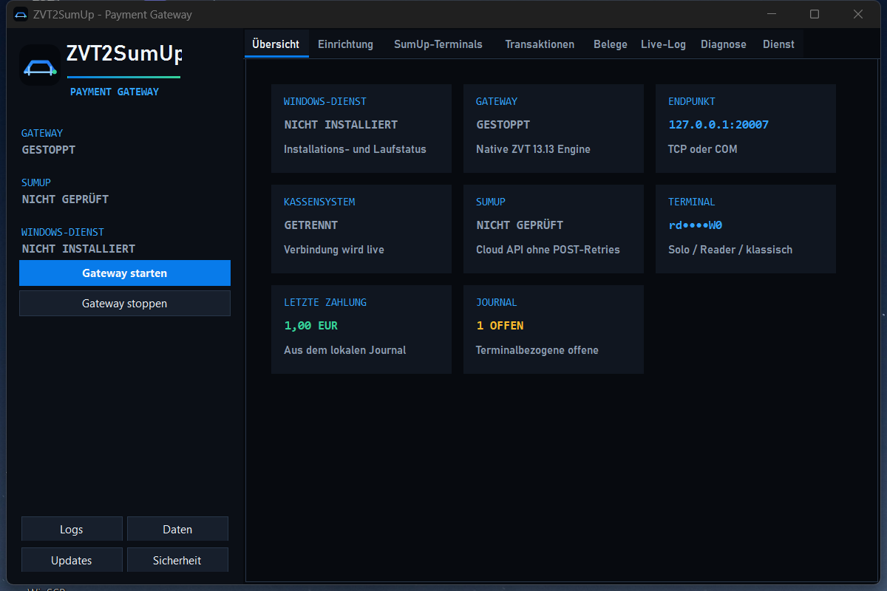
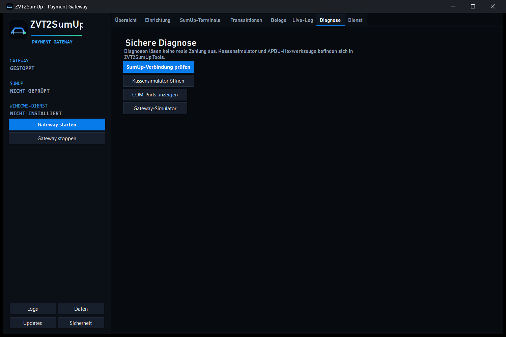
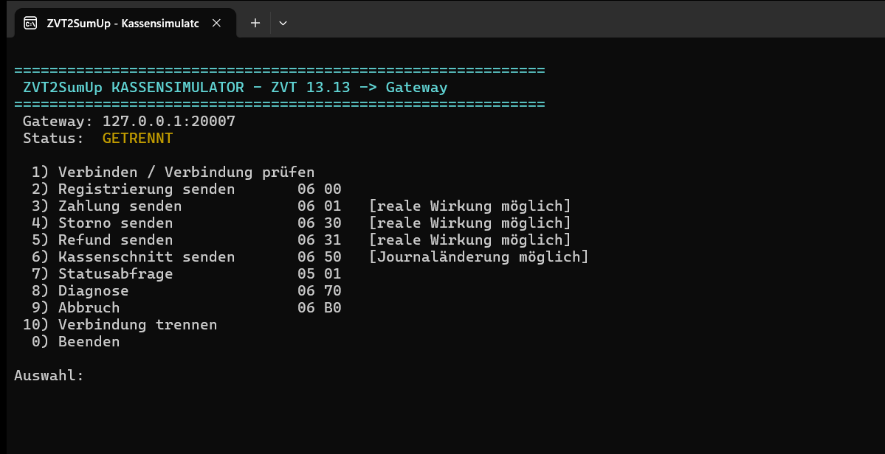

<p align="center">
  
</p>

<h1 align="center">ZVT2SumUp</h1>

<p align="center">
  Kasse verbinden. Zahlung sicher ausführen.<br>
  Ein natives Windows-Gateway zwischen ZVT 13.13 und SumUp.
</p>

<p align="center">
  <a href="https://github.com/Oexyz/zvt2sumup/actions/workflows/build-windows.yml"></a>
  <a href="https://github.com/Oexyz/zvt2sumup/releases/latest"></a>
  
  
  
  
  <a href="LICENSE"></a>
</p>

<p align="center">
  
  
  
  
  
</p>



<details>
<summary>Sichere Diagnoseansicht</summary>



</details>

<details>
<summary>Interaktiver ZVT-13.13-Kassensimulator</summary>



</details>

ZVT2SumUp ist eine vollständig in C# entwickelte **Windows-Desktop-App**, ein
**Windows-Dienst** und ein Diagnosewerkzeug für die Anbindung eines
ZVT-Kassensystems an SumUp. Das Gateway implementiert das ZVT-Protokoll nativ,
spricht die SumUp-API über typisierte HTTP-Clients an und bringt die benötigte
.NET-Laufzeit im self-contained Windows-Build direkt mit.

**Suchbegriffe:** ZVT Gateway, ZVT 13.13, SumUp Integration, SumUp Solo,
Kartenterminal, Payment Gateway, POS, Point of Sale, KORONA, Kassenanbindung,
WinForms, Windows-Dienst, TCP, COM und serielle Schnittstelle.

> [!IMPORTANT]
> Offizielle Binärdateien werden ausschließlich als versioniertes GitHub
> Release mit dem separaten Asset `checksums.sha256` veröffentlicht. Dateien
> aus Drittquellen oder neu hochgeladene Ersatzarchive nicht verwenden.

## Zwei Dateien, zwei klare Aufgaben

Ein self-contained `win-x64`-Build enthält exakt:

| Datei | Aufgabe |
|---|---|
| `ZVT2SumUpGateway.exe` | Startet per Doppelklick die Verwaltungsoberfläche; dieselbe Datei läuft mit `--service` als Windows-Dienst. |
| `ZVT2SumUp.Tools.exe` | Startet per Doppelklick den interaktiven Kassensimulator; enthält außerdem Diagnose, Gateway-Simulator, COM-Erkennung und explizite Dienstverwaltung. |

Windows 10 oder 11 x64 genügt. Ein separates .NET Runtime und ein
Installationsprogramm sind nicht erforderlich.

## Was ZVT2SumUp kann

- ZVT PA00P015 Revision 13.13 über TCP oder COM verarbeiten.
- KORONA-kompatible RAW-APDUs automatisch von TCP-Längenrahmen unterscheiden.
- Zahlungen über SumUp Reader beziehungsweise Solo auslösen und zuverlässig
  auf `04 0F` plus minimale Completion `06 0F 00` abbilden.
- Registrierung, Status, Abmeldung, Storno, vollständige oder teilweise
  Rückerstattung, Kassenschnitt, Teilabgleich, Diagnose und Belege verarbeiten.
- Reader über einen 8- bis 9-stelligen Pairing-Code koppeln, Terminals anzeigen
  und Transaktionen abrufen.
- Zahlungen pro Terminal serialisieren und automatische POST-Retries vermeiden.
- Ein terminalbezogenes, atomar geschriebenes Journal in Integer-Cent führen.
- Belegvorlagen bearbeiten und eine Vorschau anzeigen. Ein Gateway-Beleg
  ersetzt ausdrücklich **keinen fiskalischen KORONA- oder TSE-Bon**.
- Als interaktive WinForms-App oder als automatisch startender Windows-Dienst
  dieselbe Gateway-Engine verwenden.
- Updates ausschließlich aus freigegebenen GitHub-HTTPS-Hosts laden, gegen ein
  eindeutiges SHA-256-Manifest und die eingebetteten EXE-Versionen prüfen,
  vorab per Smoke-Test ausführen und mit Zwei-Dateien-Rollback installieren.

Die genaue Abdeckung steht in der
[ZVT-Kompatibilitätsmatrix](docs/ZVT_COMPATIBILITY.md).

## Schnellstart

1. `ZVT2SumUp-win-x64.zip` und `checksums.sha256` aus dem
   [aktuellen GitHub Release](https://github.com/Oexyz/zvt2sumup/releases/latest)
   herunterladen, den SHA-256-Wert prüfen und das ZIP vollständig entpacken.
2. `ZVT2SumUpGateway.exe` starten.
3. Unter **Einrichtung** zuerst TCP auf `127.0.0.1:20007` belassen und die
   gewünschte Währung kontrollieren.
4. API-Key ausschließlich im vorgesehenen Geheimnisfeld eintragen, Zugriff
   testen und Merchant sowie Terminal auswählen.
5. Bei einem neuen Solo/Reader den Pairing-Code in der App koppeln. Den Code
   weder in Issues noch in Screenshots veröffentlichen.
6. Gateway starten und erst danach die Kasse verbinden.
7. Zunächst Registrierung und Status prüfen. Eine reale Testzahlung nur mit
   bewusst gewähltem Kleinstbetrag und unter Beobachtung am Terminal auslösen.

Für Dienstbetrieb, COM und Prüfsummen siehe [Installation](INSTALLATION.md).

## Sicherheit als Standardeinstellung

- Das Gateway lauscht standardmäßig nur auf `127.0.0.1`. Eine externe
  Bind-Adresse wird validiert und in der Oberfläche sichtbar gewarnt.
- API- und Affiliate-Schlüssel liegen nicht im Klartext in `config.ini`, sondern
  Windows-DPAPI-verschlüsselt in `%ProgramData%\ZVT2SumUp\secrets.dat`.
- Der Datenordner wird für `SYSTEM`, Administratoren und den einrichtenden
  Benutzer gehärtet. Berechtigungen müssen nach Kontowechseln erneut geprüft
  werden.
- Authorization-Header, benannte Schlüssel, Tokens und Pairing-Codes werden vor
  Fehlermeldungen und Logs redigiert.
- Geldbeträge werden als Integer-Minor-Units oder `decimal` verarbeitet.
- Zahlungs-POSTs werden nicht automatisch wiederholt.
- Die CLI sendet eine reale Zahlung nur mit dem zusätzlichen, exakten Schalter
  `--confirm-real-payment`.
- Der Updater akzeptiert ausschließlich feste GitHub-HTTPS-Hosts, ein exakt
  benanntes ZIP sowie `checksums.sha256`; Austausch und Dienstneustart werden
  bei einem Fehler auf beide vorherigen EXE-Dateien zurückgerollt.
- Es gibt keine Telemetrie, Werbung, Remote-Plugins oder automatische reale
  Zahlungstests.

Ausführliche Angaben, Grenzen und sichere Meldung von Schwachstellen:

- [Sicherheitsrichtlinie](SECURITY.md)
- [Sicherheit und Datenschutz](docs/SECURITY_AND_PRIVACY.md)
- [Support ohne Geheimnislecks](SUPPORT.md)

> [!WARNING]
> Der aktuelle Build ist nicht mit Windows Authenticode signiert. Ein
> SHA-256-Wert erkennt Änderungen, beweist allein aber weder Herausgeber noch
> Build-Ursprung. Releaseassets nur direkt aus dem erwarteten Repository laden
> und immer gegen `checksums.sha256` prüfen. SmartScreen kann warnen.

## Diagnose ohne unbeabsichtigte Zahlung

```powershell
.\ZVT2SumUp.Tools.exe help
.\ZVT2SumUp.Tools.exe sumup-test
.\ZVT2SumUp.Tools.exe transactions
.\ZVT2SumUp.Tools.exe com-list
.\ZVT2SumUp.Tools.exe com0com-detect
.\ZVT2SumUp.Tools.exe gateway-simulator --port 20008
```

Die Befehle oben erzeugen keine Zahlung. Dagegen können `payment`, `refund`,
`reconcile` und frei gewählte `raw`-APDUs einen realen oder irreversiblen
Betriebsvorgang auslösen. Alle Tools-Befehle und Schutzschalter sind in
[TOOLS.md](docs/TOOLS.md) beschrieben.

## Daten und Netzwerkziele

Gemeinsame Daten liegen unter `%ProgramData%\ZVT2SumUp\`:

| Datei/Ordner | Inhalt |
|---|---|
| `config.ini` | Nicht geheime Einstellungen und verschlüsselte Platzhalter |
| `secrets.dat` | DPAPI-verschlüsselte API- und Affiliate-Daten |
| `transaction_journal.json` | Lokales Zahlungs- und Refund-Journal |
| `receipt_templates.ini` | Belegvorlagen und Händlertexte |
| `receipt_counter.txt` | Fortlaufender Gateway-Belegzähler |
| `logs\` | Rollierende Betriebslogs |
| `updates\` | Administrativ geschütztes Update-Staging und redigiertes `update.log` |

Im Normalbetrieb kommuniziert die Anwendung nur mit dem lokal oder bewusst
konfigurierten ZVT-Endpunkt, `api.sumup.com` und nach einem manuellen Klick auf
**Updates** mit `api.github.com` sowie freigegebenen GitHub-Downloadhosts. Es
werden keine vollständigen Kartennummern oder PINs angefordert oder gespeichert.

## Nachvollziehbare Architektur

| Projekt | Verantwortung |
|---|---|
| `Zvt2SumUp.Core` | Modelle, Konfiguration, Geldtypen und Schnittstellen |
| `Zvt2SumUp.Protocol` | ZVT-Registry, BCD, BMP, BER-TLV sowie TCP-/COM-Framing |
| `Zvt2SumUp.SumUp` | SumUp-Verträge und typisierter HTTP-Client |
| `Zvt2SumUp.Infrastructure` | Gateway, Transport, Journal, Belege, DPAPI, Logs und Updates |
| `Zvt2SumUp.Service` | Generic Host und Windows-Dienst-Worker |
| `Zvt2SumUp.Desktop` | Native deutsche WinForms-Verwaltung |
| `Zvt2SumUp.Tools` | Sichere CLI, Simulatoren und Dienstaktionen |
| `Zvt2SumUp.Tests` | 42 lokale Unit- und Integrationstests ohne echte Zahlungen |

Mehr Details: [ARCHITECTURE.md](ARCHITECTURE.md),
[Testnachweise](docs/TESTING.md), [sicherer Releaseprozess](docs/RELEASING.md)
und [GitHub Topics](docs/GITHUB_TOPICS.md).

## Aus dem Quellcode bauen

Benötigt werden Windows x64, Git und das .NET 10 SDK. `Publish.ps1` baut beide
Programme in einen neuen, datierten Ordner und prüft, dass das Endpaket exakt
zwei EXE-Dateien enthält.

```powershell
git clone https://github.com/Oexyz/zvt2sumup.git
Set-Location zvt2sumup
.\Publish.ps1
```

Manuell entsprechen die Prüfschritte der GitHub Action:

```powershell
dotnet restore .\Zvt2SumUp.slnx --locked-mode
dotnet build .\Zvt2SumUp.slnx -c Release --no-restore
dotnet test .\tests\Zvt2SumUp.Tests\Zvt2SumUp.Tests.csproj -c Release --no-build
dotnet publish .\src\Zvt2SumUp.Desktop\Zvt2SumUp.Desktop.csproj -c Release -r win-x64 --self-contained true
dotnet publish .\src\Zvt2SumUp.Tools\Zvt2SumUp.Tools.csproj -c Release -r win-x64 --self-contained true
```

Beiträge beginnen mit [CONTRIBUTING.md](CONTRIBUTING.md). Abhängigkeiten und
deren Lizenzhinweise stehen in [THIRD_PARTY_NOTICES.md](THIRD_PARTY_NOTICES.md).

## Verantwortungsvolle Verwendung

Jede ausgelöste Zahlung oder Rückerstattung kann reale finanzielle Folgen
haben. Nur eigene beziehungsweise ausdrücklich autorisierte Händlerkonten,
Terminals und Kassensysteme verwenden. Testbeträge unmittelbar im SumUp-Dashboard
prüfen und notwendige Rückerstattungen bewusst auslösen. Niemals API-Keys,
Pairing-Codes, Authorization-Header, vollständige Logs oder unbearbeitete
Konfigurationsdateien in öffentliche Issues hochladen.

SumUp und KORONA sind Marken ihrer jeweiligen Inhaber. ZVT2SumUp ist ein
unabhängiges Projekt und wird von diesen Unternehmen weder betrieben noch
offiziell unterstützt.

## Lizenz

ZVT2SumUp steht unter der [MIT-Lizenz](LICENSE). Drittkomponenten und externe
Spezifikationen behalten ihre eigenen Rechte und Bedingungen; Details stehen in
[THIRD_PARTY_NOTICES.md](THIRD_PARTY_NOTICES.md).
